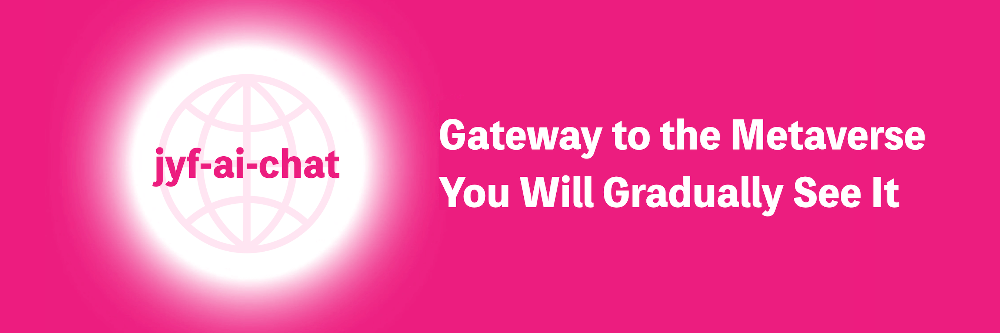

  
  
  
  
  
  
  
  
  
  
  
  
  

## Introduction
jyf-ai-chat est un projet visionnaire, un chatbot IA développé sur dify, dédié à fournir des expériences de conversation pratiques. Construit avec des technologies web modernes, il offre une interface fluide et des fonctionnalités riches.

## Caractéristiques
- Chatbot IA basé sur dify
- Prise en charge du changement de langue
- Compatibilité multiplateforme (Web, Mobile)
- Prise en charge de multiples modèles IA
- Options de personnalisation de thème riches
- Persistance des données locales
- Conception réactive, adaptation multi-appareils
- Prise en charge du rendu Markdown
- Mise en évidence du code
- Historique des conversations sauvegardé

## Démarrage rapide

### Prérequis
- Node.js 20.0 ou supérieur

### Installer les dépendances
- npm install
- npm run dev

### Build de production
- npm run build

### Accès navigateur
- http://localhost:5173?Token=dify-api-key&Uid=1

- Token : Jeton dify
- Uid : Toute valeur unique

## Communauté & Support
Nous accueillons les contributions pour améliorer jyf-ai-chat : code, signalements de problèmes et nouvelles idées. Nous encourageons également le partage du projet lors d'événements et sur les réseaux sociaux.

## Sécurité
Pour protéger votre vie privée, évitez de publier des problèmes de sécurité sur GitHub. Contactez 18321212571@163.com pour une assistance détaillée.

## Licence
Ce projet est sous licence Apache 2.0