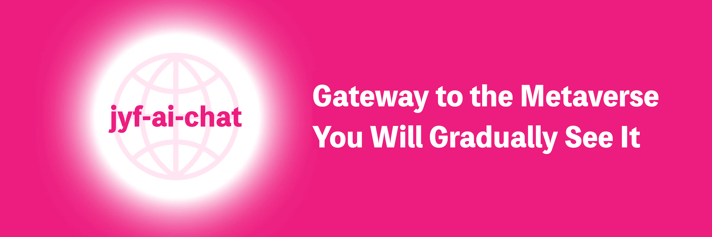

  
  
  
  
  
  
  
  
  
  
  
  
  

## Introduzione
jyf-ai-chat è un progetto visionario, un chatbot AI basato su dify, dedicato a fornire esperienze di conversazione convenienti. Costruito con tecnologie web moderne, offre agli utenti un'interfaccia fluida e funzionalità ricche.

## Caratteristiche
- Chatbot AI basato su dify
- Supporto multilingue
- Compatibilità multipiattaforma (Web, Mobile)
- Supporto per più modelli AI
- Ampie opzioni di personalizzazione del tema
- Archiviazione locale dei dati
- Design reattivo, adattamento a più dispositivi
- Supporto per il rendering Markdown
- Evidenziazione del codice
- Salvataggio della cronologia delle chat

## Guida Rapida

### Requisiti
- Node.js 20.0 o superiore

### Installare le dipendenze e avviare lo sviluppo
- npm install
- npm run dev

### Build di produzione
- npm run build

### Aprire nel browser
- http://localhost:5173?Token=dify-api-key&Uid=1

- Token: token API di dify
- Uid: Qualsiasi valore univoco

## Comunità e Supporto
Accogliamo con favore i contributi per migliorare jyf-ai-chat, tra cui: invio di codice, segnalazione di problemi e nuove idee. Incoraggiamo anche a condividere il progetto in eventi, conferenze e sui social media.

## Sicurezza
Per proteggere la tua privacy, evita di pubblicare problemi di sicurezza su GitHub. Invia domande a 18321212571@163.com per assistenza dettagliata.

## Licenza
Questo progetto è concesso in licenza Apache 2.0